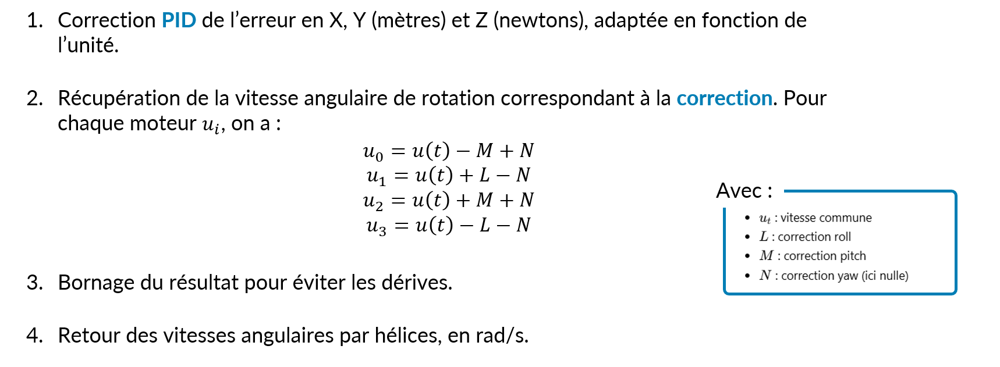
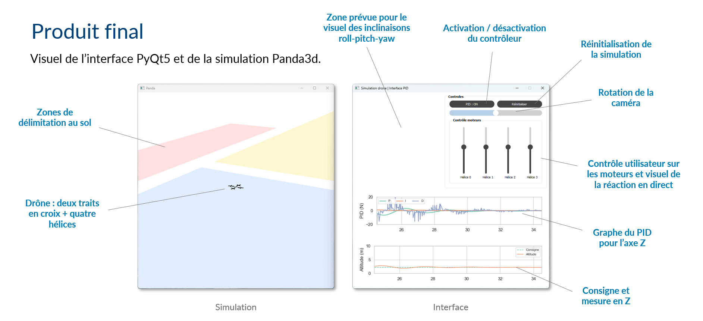

# Généralités
L'objectif de ce mini-projet, tenu sur deux semaines de jours ouvrés, était de me former aux concepts qui vont être abordés durant le stage. Il s'agissait aussi de prendre du recul par rapport à l'objectif du stage, pour avoir une vision plus générale du sujet. Thibaut avait fixé une consigne dans ce cadre, et j'ai ensuite établi des objectifs liés à cette consigne.

**Consigne :** Mise en œuvre d’un système mécatronique et autres permettant de mettre en œuvre un filtre simple ou complexe d’asservissement.

**Objectif :** Simuler un drône en Python, soumis à des facteurs de perturbation, pour programmer son asservissement en position.

# Logique fonctionnelle

## 1. Architecture

Le dossier source comprend un scripte principal, nommé `main.py`. Il sert à lancer le projet dans sa globalité. Pour se faire, il utilise les quatre packages créés :
- **Simulation** | Lance la simulation du drone en 3D. Implémente les lois de la physique appliquées au drône, pour simuler un comportement réaliste.
  
- **Interface** | Permet d'instancier une interface utilisateur, via laquelle il est possible d'agir sur la simulation.
  
- **Controle** | Contient les lois d'asservissement des moteurs du drône, pour le soumettre à une consigne donnée.
  
- **Utiles** | Contient un logger pour les tests, le fichier des constantes utilisées au cours du projet, le style de l'interface et des fonctions utiles.

Chacun de ces dossiers comprend un fichier README.md, qui capitalise en les fonctionnalités.

## 2. Implémentation de la physique

Concernant l'implémentation de la physique, j'ai mis en place :
- Une dynamique angulaire avec des moments en roll, pitch et yaw,
- Une dynamique linéaire avec le poids, la poussée, la traînée et des frottements.

J'ai tenté de différencier les repères Monde / Drône dans mon approche.

## 3. Implémentation du contrôleur

J'ai pu tester différentes approches, notamment :

- Une correction simple de stabilisation horizontale en XY, sans suivi de consigne. Elle est fonctionnelle.
- Une correction PID pour suivi de consigne. Fonctionnelle en Z, mais pas en XY.
- Une correction PID pour suivi de consigne, avec un retour de capteurs IMU filtré par un EKF. Fonctionnel en Z, mais pas en XY.

Après ces différents tests, j'ai adopté l'option 2 pour la version finale. Voici la logique fonctionnelle suivie : 

    

# Résultat

## 1. Interface

Voici un visuel de l'interface et de la simulation 3D, au jour où j'ai dû le rendre. Donc hier.

L'interface n'est pas finalisée en soi, cependant, le mini-projet est terminé, donc il s'agit de sa version finale.

## 2. Simulation

Le contrôle en Z fonctionne bien : lorsque le drône tombe verticalement ou lorsqu'il démarre à une hauteur différente de la consigne, il arrive à l'atteindre. Il oscille un peu, jusqu'à finalement s'arrêter à l'altitude cible.

Par contre, en XY, le contrôle ne fonctionne pas. Malgré les différentes méthodes explorées, je n'ai pas réussi à asservir le drône en position sur XY. Lorsque l'utilisateur dérègle légèrement l'un des moteurs, le drône part légèrement sur le côté. Il compense assez lentement, en ajustant les puissances de ses moteurs pour y répondre. Sauf que la compensation est trop lourde, et il finit par diverger, puis se crash, et finit par avoir un comportement qui s'apparente à du chaotique.

J'ai plusieurs hypothèses pour l'expliquer :
- Les valeurs du PID en X et Y ne sont pas adaptées,
- L'architecture du contrôleur n'offre pas assez de précision,

- La physique de la simulation codée telle quelle engendre un comportement divergent.

# Vue extérieure

Ce mini-projet m'a permis d'avoir une vision plus nette de ce qu'est un asservissement, un filtre d'asservissement ainsi que de la manière dont sont faites les simulations du monde physique. C'était très enrichissant, et je pense que ce sera utile pour la suite de mon stage.
