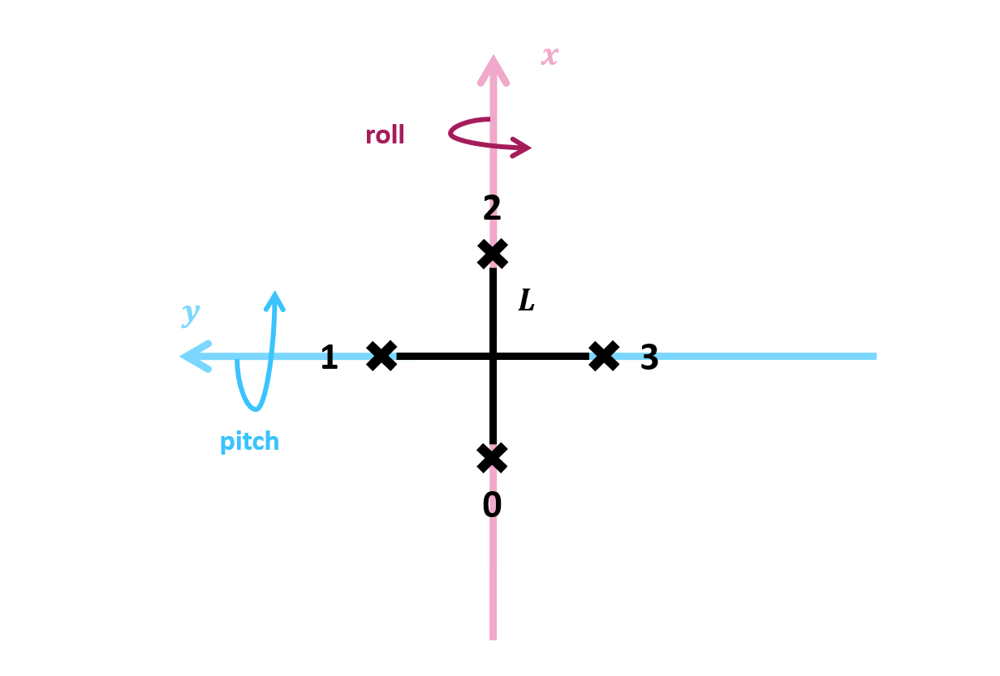

# Simulation

Ce dossier englobe toute la partie dédiée à la simulation. Le programme principal qui génère la simulation est situé dans le fichier  [`simulateur.py`](simulateur.py). C'est ici qu'est appelé la scène, puis le drône et le modèle physique associé.

## Architecture

Ce dossier est composé de 4 scriptes principaux :

- **drone.py** | Permet de modéliser un drône en 3D, comprenant un chassis et 4 hélices. Définit sa position et son orientation dans l'espace.
  
- **physique.py** | Implémente la dynamique physique du drône, avec les forces, les moments, la poussée, la collision au sol.
  
- **scene.py** | Génère un environnement 3D avec une caméra qui permet de le visualiser. Cet environnement est celui dans lequel le drône existe et évolue.
  
- **simulateur.py** | Génère la simulation du drône en 3D. Implémente la scène dans une fenêtre panda3d, puis les lois de la physique appliquées au modèle drône.

Voici un visuel de l'architecture du dossier : 
```
simulation
├── __init__.py
├── README.md
├── drone.py
├── physique.py
├── scene.py
└── simulateur.py
```


## Drône

[`drone.py`](drone.py)

Représentation graphique du drône sous Panda3D : création du corps, placement des hélices, mise à jour de la pose et de la rotation visuelle des hélices.

### Table des fonctions

| Fonction                                            | Entrée       | Sortie     | Description                                                     |
| --------------------------------------------------- | ------------ | ---------- | --------------------------------------------------------------- |
| `__init__()`                                   | `scene`      | `None`     | Initialise le modèle 3d, crée le corps, positionne les hélices. |
| `_creer_corps()`                                    | —            | `None`     | Génère la croix représentant le corps du drône.                 |
| `_creer_helices()`                                  | —            | `None`     | Crée les 4 hélices et les attache au modèle.                    |
| `_generer_helice()`                                 | —            | `NodePath` | Génère une hélice stylisée (croix).                             |
| `mettre_a_jour_pose()` | `position_xyz`, `orientation_rpy` | `None`     | Met à jour la position et l’orientation du drône en scène.      |


## Physique

[`physique.py`](physique.py)

Gère l’état physique complet du drône : dynamique moteur, forces, moments, intégration angulaire et linéaire, gestion du sol et stabilisation.

### Logique fonctionnelle

#### Dynamique des moteurs

**Méthode :** `_maj_moteurs`

Les moteurs suivent une dynamique du premier ordre. La vitesse réelle $\omega_i$ évolue vers la consigne $\omega_i^*$ avec une constante de temps $\tau$.

$\frac{d\omega_i}{dt} = \frac{\omega_i^* - \omega_i}{\tau}$

$\tau$ définit la rapidité avec laquelle la vitesse réelle $\omega_i$ rejoint la consigne $\omega_i^*$. Plus il est grand, plus le moteur est lent à répondre.

Intégration discrète sur $\Delta t$ :

$\omega_i(t+\Delta t) = \omega_i(t) + \frac{\omega_i^* - \omega_i(t)}{\tau}\,\Delta t$


#### Calcul de la traînée

**Méthode :** `_calcul_trainee`

La traînée aérodynamique modélise la force qui s’oppose au mouvement du drone dans l’air. On utilise ici la formule standard issue de la mécanique des fluides, où la force de traînée dépend :

- de la densité de l’air,
- de la surface projetée exposée au flux,
- du coefficient aérodynamique,
- et du carré de la vitesse relative.  

La formule générale de la traînée par axe est implémentée suivant :

$F_{t,i} = -\tfrac12 \, \rho \, S_i \, C_{d,i}\, |v_i|\,v_i$

où :

- $v_i$ est la vitesse du drone dans le **repère corps**,
- $S_i$ la surface projetée sur l’axe $i$,
- $C_{d,i}$ le coefficient de traînée associé,
- $\rho$ la densité de l’air.

Le calcul se fait donc en trois étapes :

1. Conversion de la vitesse du repère monde vers le **repère corps**.  
2. Application de la formule de traînée **indépendamment sur chaque axe**.  
3. Conversion de la force obtenue vers le **repère monde** pour l’intégration.

La force finale appliquée à la dynamique est :

$
\vec{F_d} = R \, 
\begin{bmatrix}
F_{t,x} \\
F_{t,y} \\
F_{t,z}
\end{bmatrix}
$

où $R$ est la matrice de rotation du repère corps vers le repère monde.

Ce modèle permet d’obtenir une traînée anisotrope (différente en X, Y et Z), plus réaliste qu’une traînée isotrope et cohérente avec la géométrie d’un quadrirotor.


#### Calcul des poussées

**Méthode :** `_calcul_poussees`

On suppose que chaque moteur produit une poussée proportionnelle au carré de sa vitesse. Il s'agit d'une approximation, puisqu'on souhaite garder un modèle simplifié.

$T_i = k_f\,\omega_i^2$

Ici, $k_f$ représente une constante, et par analogie dimensionnelle, elle est exprimée en $kg.m$, puisqu'une force s'exprime en newtons soit en $kg.m.s^{-2}$ et que les radians ne sont pas consiérés comme une unité.

La poussée totale de chaque moteur est ensuite appliquée selon l’axe vertical du corps :

$\vec{T} =
\begin{bmatrix}
0 \\
0 \\
\sum_i T_i
\end{bmatrix}$

Dans ce modèle, on regroupe donc la poussée de chaque hélice sur un seul axe, au centre du drône. C'est une approximation qui **pourrait évoluer** si on veut complexifier le modèle.

#### Calcul des moments

**Méthode :** `_calcul_poussees`

Avant de calculer les moments appliqués au drône, il est important de distinguer deux types de couples :

- **Les couples aérodynamiques**, produits par les différences de poussées entre les hélices (roll, pitch) et par la résistance de l’air au sens de rotation des moteurs (yaw).
- **Les couples gyroscopiques**, produits par le moment cinétique des hélices en rotation et qui s’opposent aux variations rapides d’orientation du drône (effets visibles en roll/pitch).

Les deux interviennent dans la dynamique angulaire, mais ils ne proviennent pas du même phénomène physique et n’agissent pas de la même manière : les couples aérodynamiques créent directement la rotation souhaitée, tandis que les couples gyroscopiques modifient la manière dont le drône réagit à cette rotation (inertie supplémentaire, précession, couplage entre axes).

Dans le code, on commence par implémenter les couples **aérodynamiques**.

Premièrement, lorsqu'un moteur possède une poussée supérieure à celui qui en est diamétralement opposé, alors le drône pivote autour de l'axe qui les sépare symétriquement. C'est ce qui se passe autour des axes $x$ et $y$ :

$\tau_x = L\,(T_1 - T_3)$

$\tau_y = L\,(T_2 - T_0)$

Avec $L$ la longueur du bras, entre le moteur et le centre. Pour mieux se le représenter, voici un schéma du drône vu du dessus, tel qu'il est déifini pour ce mini-projet :



**Attention :** ne pas changer l'ordre, sinon l'inclinaison du drône change et le visuel en simulation ne correspond pas aux changements de vitesses des hélices.

Ensuite, en $z$, chaque hélice génère un couple de réaction. Quand une hélice tourne, l'air lui oppose une résistance, de sens $+z$ si elle tourne en sens horaire et inversement.

Ce couple est proportionnel à la poussée. Dans le code, on le modélise par : 

$\tau_z = k_{\text{yaw}} \sum_i \text{sens}_i\,T_i$

avec $\text{sens}_i \in \{+1,-1\}$ le sens de rotation de l’hélice $i$, et $k_{\text{yaw}}$ un facteur de valeur faible, pour minimiser le couple en $z$.

**Remarque :** amusez-vous à le changer.

Ensuite, on implémente le **couple gyroscopique**. 

Chaque hélice en rotation possède un moment cinétique $L_i = J_h \omega_i$, avec $J_h$ le moment d'inertie du rotor. Lorsque le drône tourne avec une vitesse angulaire $\vec{\omega}$, ce moment cinétique s’oppose aux variations d’orientation du drône. Cela génère un couple gyroscopique supplémentaire, défini par :

$\vec{\tau}_{gyro} = \vec{\omega} \times 
\begin{bmatrix}
0 \\ 0 \\ \sum_i J_h \,\omega_i\,\text{sens}_i
\end{bmatrix}$

Ce terme n'agit pas sur le yaw. Il influence uniquement les axes $x$ et $y$, et produit des effets visibles en simulation :

- une résistance au basculement, le drône est moins enclin à l'inclinaison ;
- un léger couplage roll-pitch lors de mouvements rapides ;
- un petit effet de précession (réponse déphasée) ;
- des micro-oscillations lors de variations brusques de vitesse hélice.

Ce couple est ajouté au vecteur des moments calculés précédemment.

#### Dynamique angulaire

**Méthode :** `_maj_dynamique_angulaire`

La rotation du drône autour des axes de roll (x), pitch (y) et yaw (z) est décrite par les équations d’Euler appliquées à un solide. On suppose la matrice d’inertie diagonale. Ces équations relient les moments appliqués par les hélices aux accélérations angulaires.

La dynamique angulaire peut s’exprimer sous la forme vectorielle suivante :

$\vec{\tau} = I\,\dot{\vec{\omega}} + \vec{\omega} \times (I\,\vec{\omega})$

où :

- $\vec{\tau}$ est le vecteur des moments appliqués,
- $I$ est la matrice d’inertie (diagonale dans notre cas),
- $\vec{\omega}$ est la vitesse angulaire,
- $\vec{\omega} \times (I\vec{\omega})$ est le terme gyroscopique, responsable de la **précession**.

**Note :** l’effet de précession peut être décrit par le fait qu'une rotation rapide autour d’un axe produit un moment parasite autour des deux autres axes. C'est ce qui se passe, par exemple, quand on essaie de faire bouger une toupie en mouvement. Dans les constantes, si on augmente la valeur de `K_YAW`, on pourra observer cce phénomène lors dun changement de vitesse angulaire, par exemple pour `"K_YAW" : 0.2`.

Dans le code, on ajoute aussi un terme d’amortissement $k_{\text{amort}}\,\omega$ pour simuler un frottement visqueux. Il permet d’éviter qu’une rotation ne persiste indéfiniment en l’absence de couple appliqué. on obtient donc la formule suivante : 

$\vec{\tau} = I\,\dot{\vec{\omega}} + \vec{\omega} \times (I\,\vec{\omega}) + k_{\text{amort}}\,\omega$

Dans le cas actuel, on cherche à récupérer l'accélération angulaire résultant de l'instant $t$, définie par le terme $\dot{\vec{\omega}}$, pour intégrer l'effet ressortissant à la vitesse angulaire à l'instant $t+\Delta t$.

On calcule cette accélération angulaire en isolant l'inertie :

$\dot{\vec{\omega}} = \frac{1}{I} (\vec{\tau} - \vec{\omega} \times (I\,\vec{\omega}) - k_{\text{amort}}\,\omega)$

Ensuite, le modèle est mis à jour pour le pas temporel $\Delta t$. Puisque $\dot{\omega} = \frac{\omega}{t}$, on a $\dot{\omega} = \frac{d\omega}{dt} \Leftrightarrow d\omega = \dot{\omega} dt$. On ajoute donc au modèle de l'instant $t+\Delta t$ le déplacement angulaire infinitésimal correspondant :

- Vitesses angulaires :  
  $\omega(t+\Delta t) = \omega(t) + \dot{\omega}\,\Delta t$

- Orientations (roll, pitch, yaw) :  
  $\text{angles}(t+\Delta t) = \text{angles}(t) + \omega(t+\Delta t)\,\Delta t$

Cela met à jour l'inclinaison du drône dans l'espace et la vitesse angulaire de ses hélices sur le pas temporel $\Delta t$.

#### Dynamique linéaire

**Méthode :** `_maj_dynamique_lineaire`

Après avoir intégré la dynamique angulaire, on passe à la dynamique linéaire. On calcule la poussée dans le repère corps, puis on la convertit dans le repère monde sur $(x, y, z)$, grâce à la matrice de rotation $R(\text{roll, pitch, yaw})$. On ajoute aussi la traînée aérodynamique et le poids. Enfin, des frottements sont implémentés, notamment pour éviter les dérives en $(x, y)$ lorsque les moteurs ont tous une vitesse sensiblement égale.

- Poussée repère monde : $\vec{T} = R \cdot \begin{bmatrix}0 \\ 0 \\ \sum_i T_i\end{bmatrix}$, avec $T_i = k_f\,\omega_i^2$.

- Traînée : $\vec{F_d} = R \cdot \, \begin{bmatrix} F_{t,x} \\ F_{t,y} \\ F_{t,z} \end{bmatrix}$, avec $F_{t,i} = -\tfrac12 \, \rho \, S_i \, C_{d,i}\, |v_i|\,v_i$.

- Poids : $\vec{P} = \begin{bmatrix}0 \\ 0 \\ -mg\end{bmatrix}$, avec $m$ la masse du drône et $g$ l'accélération normale de pesanteur terrestre.

- Frottements : $\vec{F_f} = \begin{bmatrix} F_{f,x} \\ F_{f,y} \\ F_{f,z} \end{bmatrix}$, avec $F_{f,i} = - k_{\text{lin},i}\, v_i - k_{\text{quad},i}\, |v_i|\, v_i$.

On peut ensuite calculer l'accélération grâce à la loi de Newton : 

$\vec{F} = m \vec{a} = \vec{T} + \vec{F}_{t} + \vec{P} + \vec{F_f}$

Par définition, $a = \frac{dv}{dt} \Leftrightarrow dv = a dt$. On peut donc intégrer le résultat de l'accélération à la vitesse en le multipliant par un facteur $\Delta t$, puis intégrer cette vitesse à la position :


- Vitesse : $\vec{v}(t+\Delta t) = \vec{v}(t) + \vec{a}\,\Delta t$

- Position : $\vec{x}(t+\Delta t) = \vec{x}(t) + \vec{v}(t+\Delta t)\,\Delta t$

Cela met à jour la position du drône dans l'espace et sa vitesse sur le pas temporel $\Delta t$, en $(x, y, z)$.

#### Gestion du sol, frottements et rebond

**Méthode :** `_gestion_sol_et_stabilisation`


Lorsque le drône arrive à une hauteur seuil $h_{\text{min}}$, qui représente le sol, une collision est détectée. À ce moment-là, différents éléments sont pris en compte :

1. **Blocage au sol**  
   On force la hauteur à rester telle quelle dans un premier temps, pour éviter que le drône aille sous terre : $z \leftarrow h_{min}$. Par ailleurs, roll et pitch sont remis à zéro.

2. **Frottements horizontaux**  
   Si $\|\vec{v}_{xy}\|$ est significative, on a la diminue proportionnellement à elle-même, selon un facteur de frottements lié au sol, noté $k_f$ : 
   $\vec{v}_{xy} - k_f\,\vec{v}_{xy}\,\Delta t$

   Lorsque $\|\vec{v}_{xy}\|$ devient faible, on impose :  
   $v_z = 0$  
   $\dot{\psi} = 0$

3. **Amortissement du yaw**  
   Suite à l'observation, il a été décidé de réduire drastiquement la vitesse angulaire en yaw lors de l'impact au sol : $\dot{\psi} \leftarrow \dot{\psi}\,e^{-k_{yaw}\Delta t}$. Autrement, le drône continuait parfois à tourner sur lui-même après s'être totalement arrêté.

4. **Rebond**  
    Si l'impact est assez violent, un effet de rebond est ajouté sur la hauteur :

    $v_z(t+\Delta t) = 
    \begin{cases}
    -c_r\,v_z(t) & \text{si } v_z(t) < -v_{seuil} \\
    0 & \text{sinon}
    \end{cases}$
    
    avec $c_r \in [0,1]$, le coefficient de restitution, et $v_{\text{seuil}}$ la vitesse minimale à l’impact. On pourra remarquer que les valeurs sont négatives : c'est parce que l'effet agit quand le système se dirige vers le bas, donc pour un $z$ négatif.

1. **État crash**  
   Un booléen définit l'état du système : `self.crash = True` sinon `False`.


### Table des fonctions

| Fonction                          | Entrée                   | Sortie    | Description                                                          |
| --------------------------------- | ------------------------ | --------- | -------------------------------------------------------------------- |
| `__init__()`                      | —                        | `None`    | Initialise l’état physique du drône et tous les paramètres.          |
| `_maj_moteurs()`                  | `vitesses_cibles`, `dt`  | `None`    | Met à jour les vitesses réelles des moteurs (filtre 1er ordre).      |
| `_calcul_poussees()`               | —                        | `ndarray` | Calcule les poussées individuelles des hélices.                      |
| `_calcul_moments()`               | `T`                      | `ndarray` | Calcule les moments de roll, pitch et yaw.                           |
| `_maj_dynamique_angulaire()`      | `tau`, `dt`              | `None`    | Met à jour vitesses angulaires et orientation du drône.              |
| `_maj_dynamique_lineaire()`       | `T`, `dt`                | `None`    | Intègre les forces verticales et met à jour la position.             |
| `_gestion_sol_et_stabilisation()` | —                        | `None`    | Gère la collision avec le sol et applique une stabilisation basique. |
| `etape_simulation()`              | `vitesses_helices`, `dt` | `None`    | Exécute une étape complète de simulation physique.                   |


## Scene

[`scene.py`](scene.py)

Gère l’affichage principal sous Panda3D : création du décor, zones colorées, contrôle de la caméra (orbite, zoom, rotation) et tâches de mise à jour.

### Table des fonctions

| Fonction            | Entrée                                                        | Sortie      | Description                                                                        |
| ------------------- | ------------------------------------------------------------- | ----------- | ---------------------------------------------------------------------------------- |
| `__init__()`        | —                                                             | `None`      | Initialise la scène, crée le sol, les zones, configure la caméra et les contrôles. |
| `_quitter()`        | —                                                             | `None`      | Quitte proprement l’application.                                                   |
| `tourner_gauche()`       | —                                                             | `None`      | Fait pivoter la caméra vers la gauche.                                             |
| `tourner_droite()`      | —                                                             | `None`      | Fait pivoter la caméra vers la droite.                                             |
| `_zoom_in()`        | —                                                             | `None`      | Rapproche la caméra du point cible.                                                |
| `_zoom_out()`       | —                                                             | `None`      | Éloigne la caméra du point cible.                                                  |
| `_maj_camera(task)` | `task`                                                        | `task.cont` | Met à jour la position orbitale de la caméra autour de la scène.                   |
| `_creer_sol()`      | —                                                             | `None`      | Génère le sol principal sous forme de carte 2D inclinée.                           |
| `_creer_zone()`     | `nom`, `xmin`, `xmax`, `ymin`, `ymax`, `couleur`, `hauteur_z` | `None`      | Crée une zone colorée sur le sol avec une hauteur configurable.                    |

## Simulateur

[`simulateur.py`](simulateur.py)

Il s'agit du scripte pcincipal, qui organise toute la logique de la simulation. Il coordonne les aspects suivants : PID altitude, physique, mise à jour du modèle 3D, gestion des hélices, événements Qt et interaction avec la scène.

### Table des fonctions

| Fonction                          | Entrée                                    | Sortie      | Description                                                                                 |
| --------------------------------- | ----------------------------------------- | ----------- | ------------------------------------------------------------------------------------------- |
| `__init__()`                      | `scene`, `modele_drone`, `physique_drone` | `None`      | Initialise la simulation, configure le PID, stocke les références et ajoute la tâche Panda. |
| `fixer_vitesse_helice()`          | `index`, `omega`                          | `None`      | Fixe la vitesse d’une hélice en la bornant entre 0 et la valeur maximale.                   |
| `_appliquer_controleur()`         | `dt`                                      | `None`      | Applique le PID pour ajuster les vitesses hélices selon l’altitude mesurée.                 |
| `_simuler_physique()`             | `dt`                                      | `None`      | Exécute l’étape de simulation physique (forces, moments, intégration).                      |
| `_emettre_altitude()`             | —                                         | `None`      | Émet via Qt la dernière altitude simulée.                                                   |
| `_gerer_crash()`                  | —                                         | `None`      | Coupe toutes les hélices en cas de crash détecté.                                           |
| `_mettre_a_jour_pose_3d()`        | —                                         | `None`      | Met à jour la position et l’orientation du drône dans la scène 3d.                          |
| `_mettre_a_jour_helices_visuel()` | `dt`                                      | `None`      | Met à jour les vitesses visuelles des hélices et anime leur rotation.                       |
| `mettre_a_jour_simulation()`      | `task`                                    | `task.cont` | Pipeline complet exécuté chaque frame : PID, physique, visuel, hélices.                     |
| `tourner_gauche()`                | —                                         | `None`      | Demande à la scène de pivoter la caméra vers la gauche.                                     |
| `tourner_droite()`                | —                                         | `None`      | Demande à la scène de pivoter la caméra vers la droite.                                     |

### Logique fonctionnelle

#### Application du contrôleur

**Méthode :** `_appliquer_controleur`

Cette méthode applique le contrôleur défini sur le drône pour corriger la vitesse des hélices.

1. Les valeurs de PID sont calculées pour implémenter les valeurs des vitesses de rotation des hélices.
   
2. Si l'utilisateur a la main, on le laisse changer la vitesse des moteurs.

3. Sinon, on applique les valeurs claculées par le contrôleur.
   
4. Ensuite, on cherche à stabiliser le drône, en ajoutant aux vitesses de chaque hélice une légère correction en roll et pitch pour garder le drône horizontal et éviter les dérives dans l'espace.